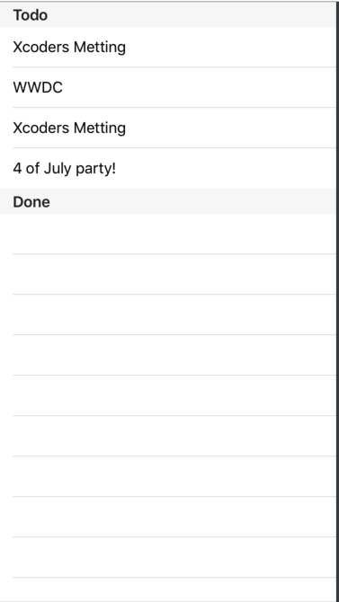

# TDD Using Swift Playgrounds

Demostration of how can you use Swift Playgrounds in Test Driven development (TDD) with XCTest.

The example loads a tableview with list of todo task:

When you tap in the task (cell) the task it would move to the done section.

For more information or any questions regarding the implementation, feel free to contact me [@luisemedr](https://twitter.com/luisemedr) or [linkedin](https://www.linkedin.com/in/luisemedrano/)
